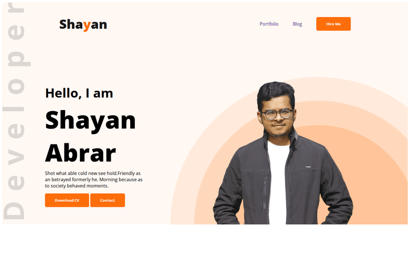
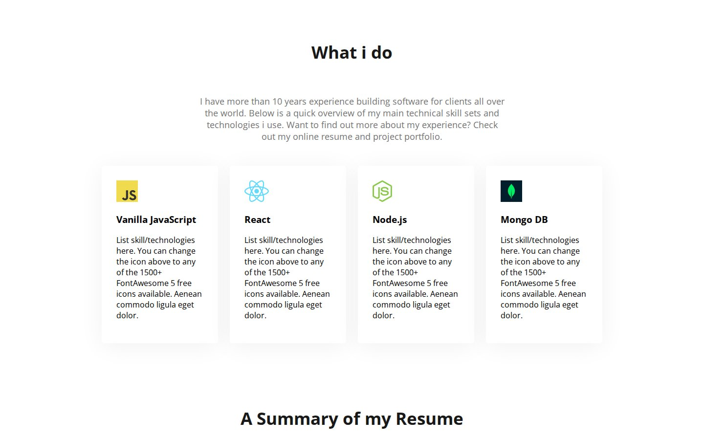
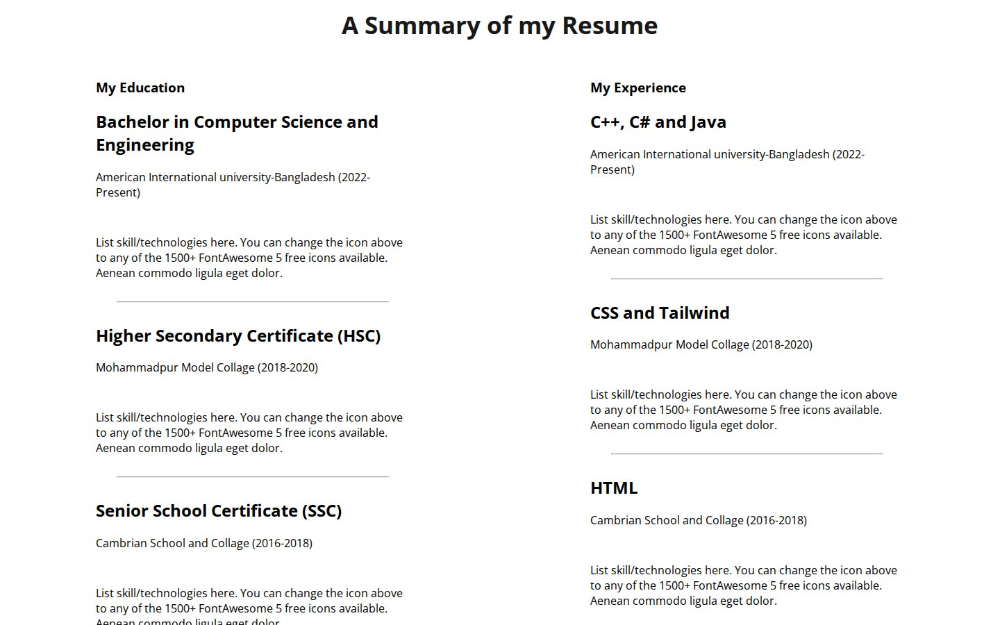
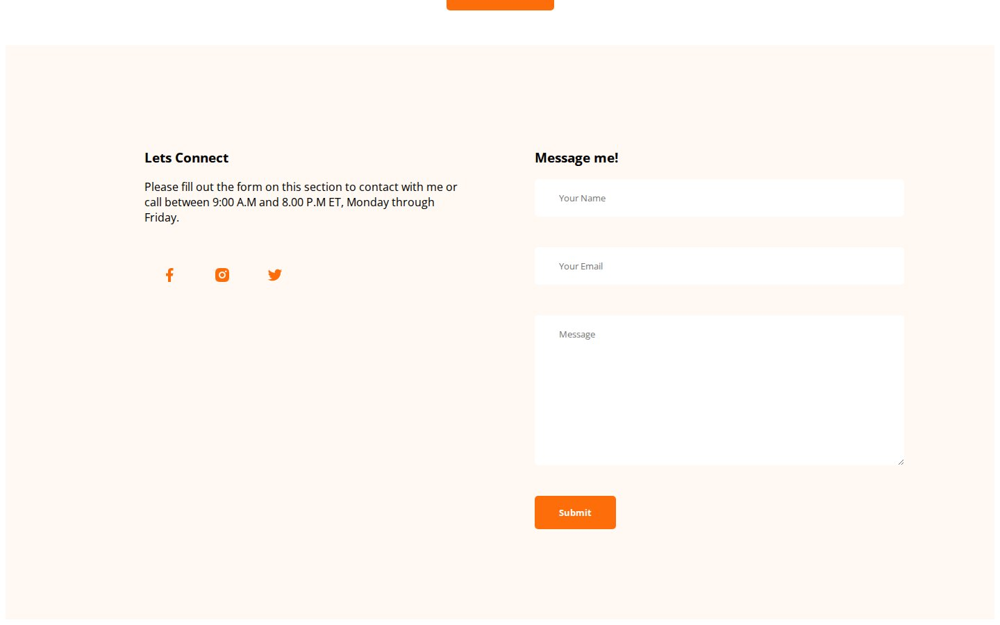

# Developer Portfolio (Early Version)

An early one-page personal portfolio, hand-built with HTML and CSS.

**Live page:** <https://shayan-abrar.github.io/developer-portfolio/> · **Current portfolio:** <https://shayan-abrar.vercel.app>

<p align="center">
  
</p>

<table>
  <tr>
    <td align="center" width="25%"><a href="screenshots/preview.png"></a><br><sub><b>Hero</b></sub></td>
    <td align="center" width="25%"><a href="screenshots/skills.jpg"></a><br><sub><b>Skills</b></sub></td>
    <td align="center" width="25%"><a href="screenshots/resume.jpg"></a><br><sub><b>Resume summary</b></sub></td>
    <td align="center" width="25%"><a href="screenshots/contact.jpg"></a><br><sub><b>Contact</b></sub></td>
  </tr>
</table>

A portfolio page has a few standard jobs: introduce the person, list skills and background, and offer a way to get in touch. This early version does that with plain HTML, one stylesheet and no framework, so the layout techniques (Flexbox rows, a decorative hero and media queries) are easy to follow. My current portfolio has replaced it.

## Quick Start

```bash
git clone https://github.com/SHAYAN-ABRAR/developer-portfolio.git
cd developer-portfolio
python3 -m http.server 8000
```

Open <http://localhost:8000>. On Windows, use `python` instead of `python3`. Opening `index.html` directly in a browser works too. The Open Sans font loads from Google Fonts, so you need an internet connection for the intended typography.

## Features

- **Hero banner:** greeting, name, **Download CV** and **Contact** buttons, a profile photo over layered circles, and a vertical "Developer" watermark.
- **About Me:** a short bio and a row of personal details.
- **What I Do:** four skill cards with icons for JavaScript, React, Node.js and MongoDB.
- **Resume summary:** two columns for education and experience, separated by rules.
- **Contact footer:** social icons and a message form with name, email and message fields.
- **Media queries:** below 992px the skills, resume, about and footer sections stack vertically. Below 576px the padding tightens and the personal details stack too.

## Customizing

The orange accent `#FD6E0A` is set in two classes in `styles/style.css`. Change it in both places to recolor the logo letter and the buttons:

```css
.text-primary {
    color: #FD6E0A;
}

.button-primary {
    border-radius: 5px;
    background: #FD6E0A;
    /* ... */
}
```

The hero's circles and the vertical "Developer" watermark are background images on `.header` (`images/header_bg.png` and `images/developer.png`). The two media queries at the end of the stylesheet control the tablet (576px–992px) and phone (under 576px) layouts.

## Limitations

- The hero's profile image has a fixed `width="900"`, so the page scrolls sideways on screens narrower than about 1,370px, including phones.
- Much of the copy is still template placeholder text (for example the hero tagline, the skill-card descriptions and the "10 years experience" line).
- The buttons, navigation links and social icons don't link anywhere, and the contact form isn't connected to a backend.

## Tech Stack

- HTML5
- CSS3 (Flexbox and media queries) in `styles/style.css`
- Google Fonts: Open Sans
- Hosted on GitHub Pages

## Contributing

Suggestions and bug reports are welcome. Please [open an issue](https://github.com/SHAYAN-ABRAR/developer-portfolio/issues). Please read the license note below before reusing any code or images.

## License

This repository doesn't have a license yet, so it doesn't grant anyone permission to reuse or redistribute its code or images. Please ask before reusing any part of it.

---

Built by **Shayan Abrar** · [GitHub](https://github.com/SHAYAN-ABRAR) · [LinkedIn](https://www.linkedin.com/in/shayan-abrar/)
